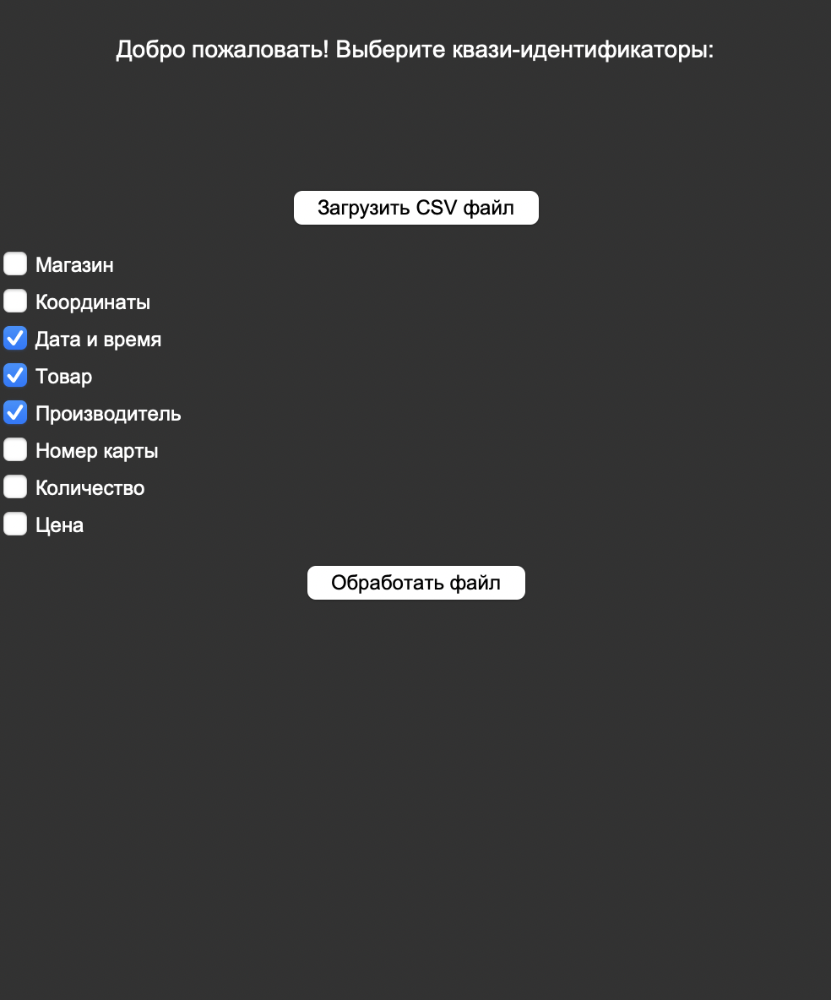
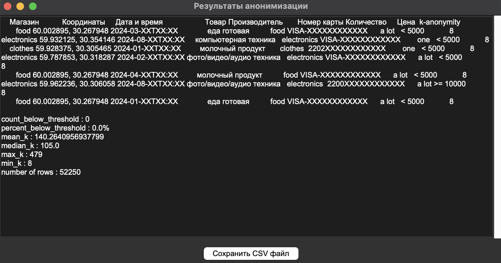

# Data Anonymization Tool

This tool provides a graphical interface to anonymize datasets using k-anonymity techniques. It is built using Python, pandas, numpy, and tkinter for the user interface.

## Features

- **GUI Interface**: A simple interface to select files and execute anonymization actions.
- **Data Masking**: Handles various types of sensitive data, such as store names, products, card numbers, and coordinates.
- **Multi-level Anonymization**: Based on the size of the dataset, different levels of anonymization can be applied.
- **K-anonymity Calculation**: Automatically calculates and updates the k-anonymity for quasi-identifiers in the dataset.
- **Data Preview**: View and scroll through loaded and anonymized datasets within the interface.

## Installation

To run the tool, you'll need Python 3.x installed. You can install the necessary packages using the `requirements.txt` file:

```bash
pip install -r requirements.txt
```

### Requirements

- Python 3.x
- pandas
- numpy
- tkinter

## Usage

1. Clone this repository.
2. Install the required packages using the `requirements.txt`.
3. Run the application using:

```bash
python main.py
```

4. A GUI window will appear allowing you to:
   - Load a dataset (CSV file).
   - Apply anonymization techniques.
   - Save the anonymized dataset to a new file.

### How to Use the GUI

1. **Load File**: Click the "Open File" button to load a CSV dataset.

2. **Anonymize Data**: Click "Anonymize" to apply k-anonymity and masking techniques.
3. **Save Anonymized Data**: Click "Save" to export the anonymized dataset.


## File Structure

- `main.py`: The main script that runs the GUI and implements the anonymization logic.
- `requirements.txt`: Lists the dependencies for running the tool.
- `README.md`: This file, providing instructions on how to use the tool.

## Future Improvements

- Add support for more complex anonymization algorithms.
- Enhance the GUI for better user interaction and more advanced settings.

## License

This project is licensed under the MIT License.
